# 🫁 TB Treatment Churn Prediction: Preventing Treatment Abandonment with ML

[](https://www.python.org/)
[](https://opensource.org/licenses/MIT)
[](https://scikit-learn.org/)
[](https://streamlit.io/)
[](https://powerbi.microsoft.com/)
[](https://www.postgresql.org/)

---

## 🔬 Project Overview

Tuberculosis (TB) remains the world's leading cause of death from a single infectious agent (1.6M deaths/year, WHO 2023). A critical challenge in TB control programs is **treatment abandonment (defaulting)**: patients who stop taking their medication for ≥2 consecutive months.

> **Why abandonment matters:**
> - Incomplete treatment causes **relapse** and worsens disease
> - Most critically, it drives **drug resistance** — MDR-TB costs ~$150,000 per case vs. $1,000 for drug-sensitive TB
> - Early identification of at-risk patients enables **preventive intervention** at a fraction of the re-treatment cost

This project builds a **churn prediction pipeline** — adapting a well-known business analytics problem to the public health domain — to identify high-risk patients **at enrollment**, before treatment starts.

**Methodological design note:** All predictive features are drawn exclusively from enrollment data (demographics, clinical baseline, social support). This enforces strict temporal validity: the model simulates a real-world early warning system with zero data leakage.

---

## 🎯 Business Problem → Data Science Solution

| Business Frame | Technical Frame |
|---|---|
| "Which patients will stop their treatment?" | Binary classification: `dropout_label` (0/1) |
| "Why is this patient at risk?" | LIME local explanations per patient |
| "Where should we concentrate resources?" | Regional analysis + feature importance |
| "How much does early intervention save?" | Cost-sensitive threshold optimization |
| "How do we present this to program managers?" | Streamlit + Power BI dashboards |

---

## 📊 Results at a Glance

| Model | AUC-ROC | Avg Precision | CV AUC |
|---|---|---|---|
| Logistic Regression | **0.702** | 0.395 | 0.627 ± 0.020 |
| Random Forest | 0.674 | 0.389 | 0.655 ± 0.039 |
| Gradient Boosting | 0.679 | 0.422 | 0.607 ± 0.041 |

**Top predictors at enrollment:** distance to clinic, patient age, social support type, employment status, region, education level.

**Cost-Sensitive Impact:** Optimizing the classification threshold (FN=$5,000 vs FP=$50) yields estimated savings of **~$475,000 per 1,000 patients** compared to no intervention — translating ML metrics directly into program impact.

---

## 📈 Visual Pipeline

### Data Quality & Distributions
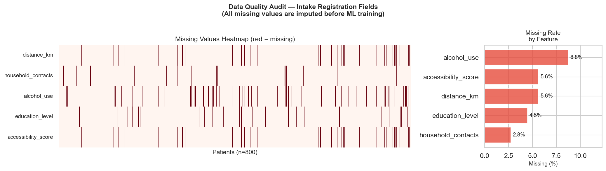
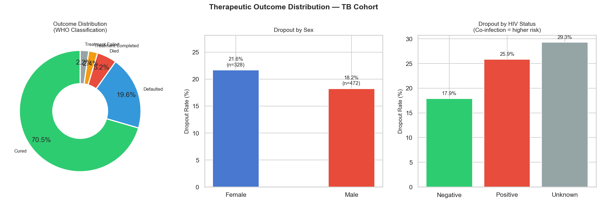

### Exploratory Analysis
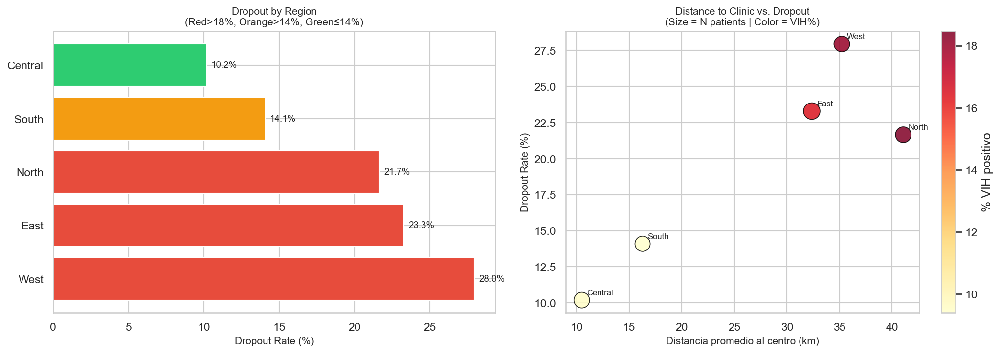
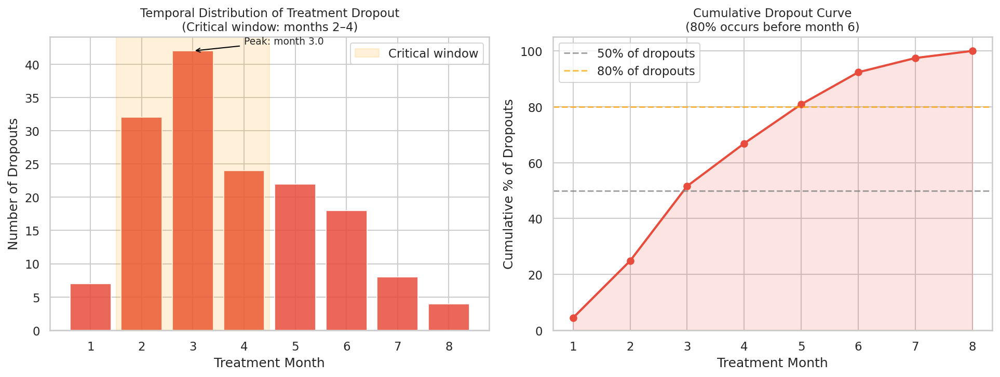
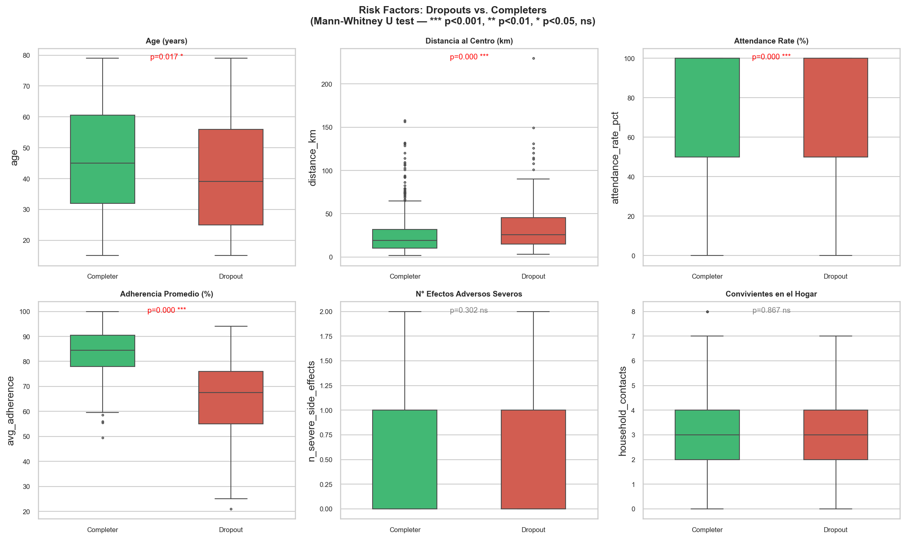
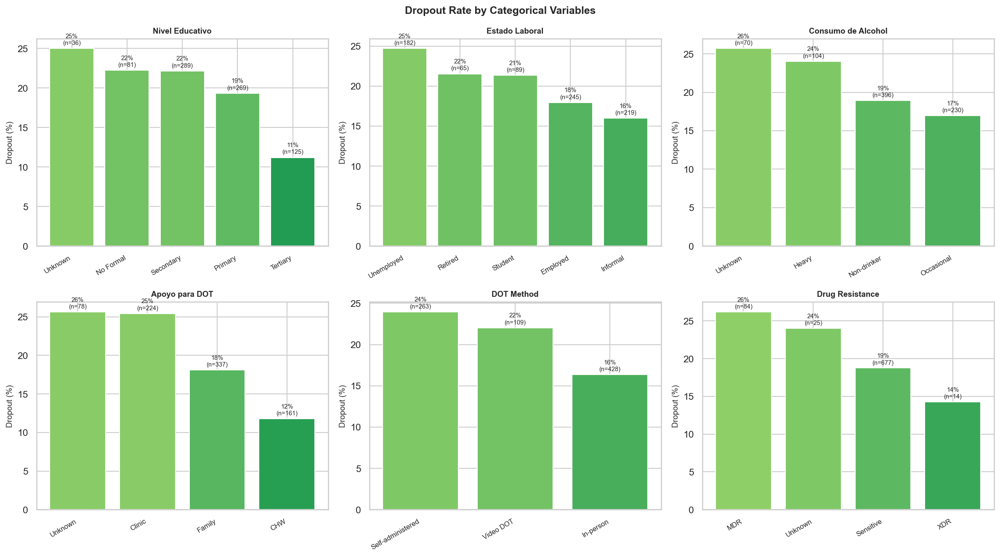

### Survival & Correlation
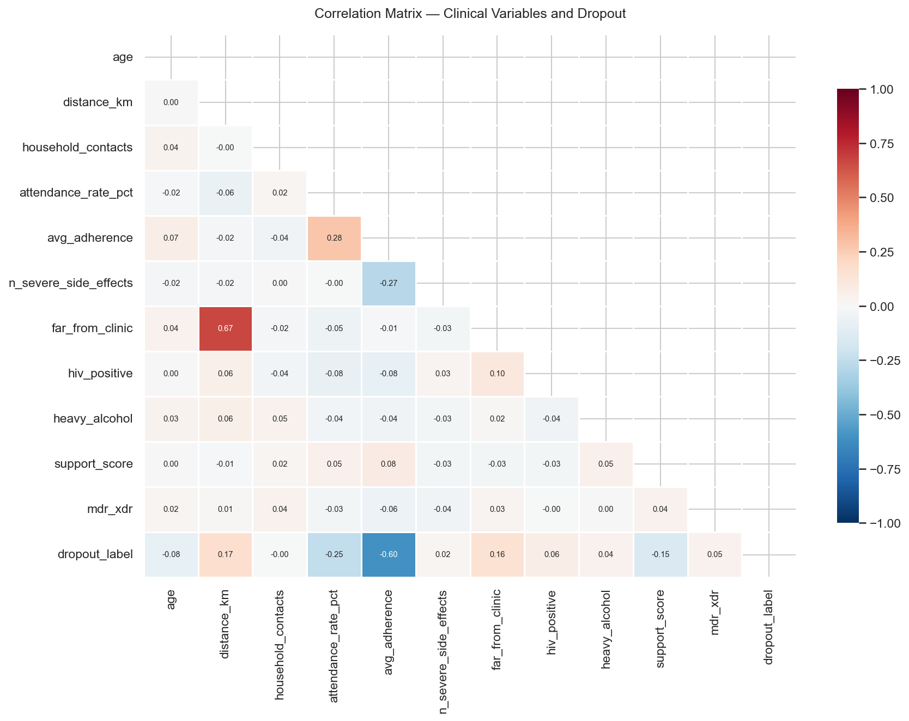
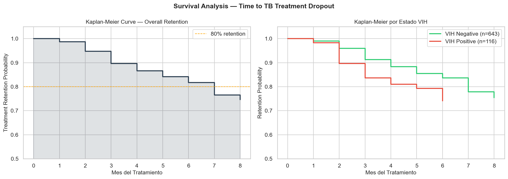

### ML Model Performance
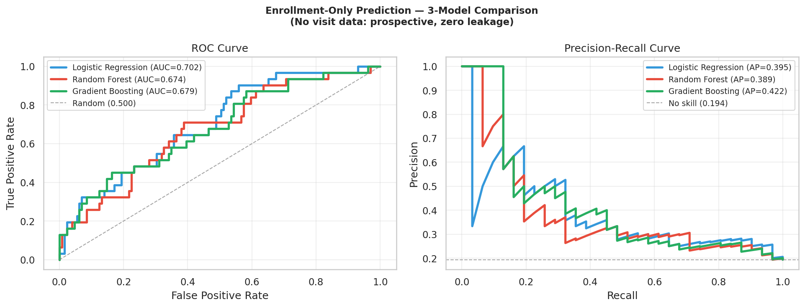
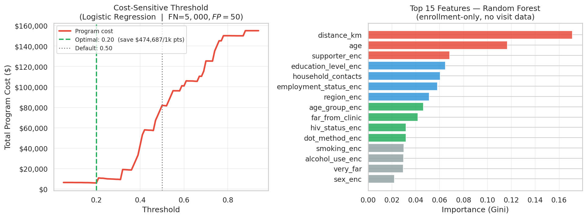

### Explainability (LIME)
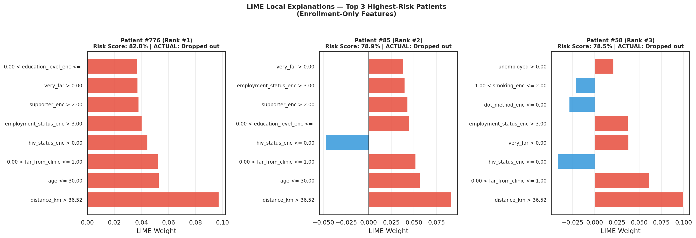
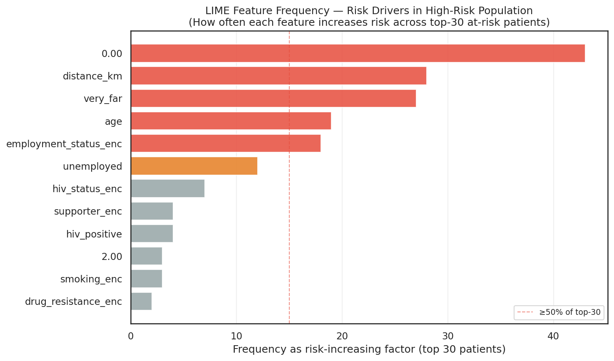

### Expert-Level Validation
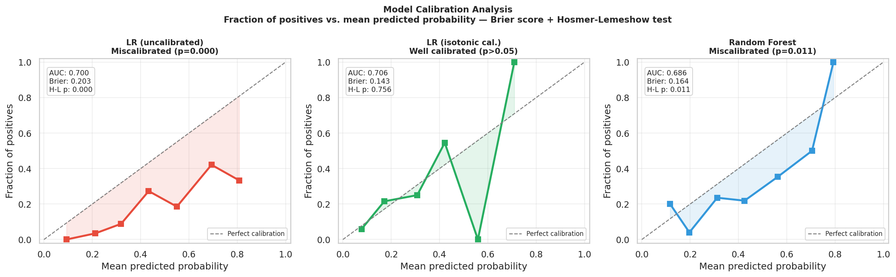
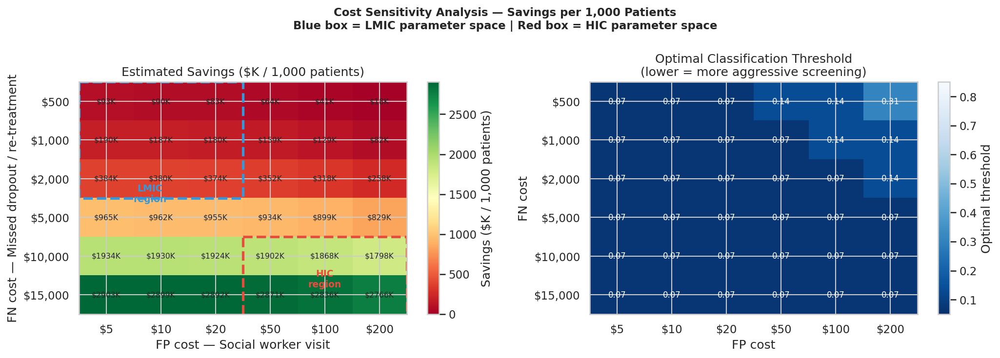
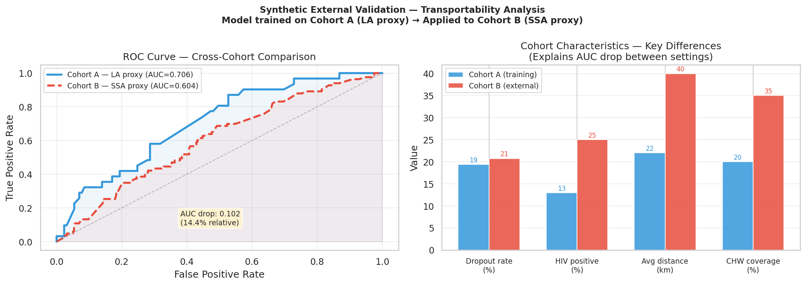

---

## 🚀 Key Features

- **Relational SQL Schema**: 4-table PostgreSQL design (patients, visits, results, treatments) with analytical views.
- **Anti-Leakage Feature Engineering**: All features derived exclusively from enrollment data — no visit-derived behavioral features. Temporal validity enforced by design.
- **3-Model Comparison**: Logistic Regression (baseline), Random Forest, Gradient Boosting — with 5-fold stratified CV.
- **Cost-Sensitive Learning**: Threshold tuned to asymmetric misclassification costs (FN = $5,000 vs FP = $50).
- **LIME Explainability**: Per-patient local explanations + population-level risk driver frequency analysis.
- **Kaplan-Meier Survival Analysis**: Treatment retention curves by region and risk group (manual implementation).
- **Streamlit Dashboard**: 4-tab interactive tool with KPIs, regional maps, top-10 risk list, and individual prediction.
- **Power BI Integration**: Executive-level BI dashboard connected to the processed data layer.

---

## 📁 Project Structure

```
tb-churn-prediction/
│
├── data/
│   ├── generate_tb_data.py           ← Realistic synthetic dataset (WHO-calibrated)
│   ├── raw/                          ← patients.csv, visits.csv, results.csv, treatments.csv
│   ├── processed/                    ← ml_dataset.csv (features + target)
│   └── sql/
│       ├── 01_schema.sql             ← PostgreSQL schema (4 tables)
│       └── 02_analytical_queries.sql ← Analytical VIEWs + master query
│
├── notebooks/
│   ├── 01_data_preparation.ipynb     ← ETL + Feature Engineering + QC audit
│   ├── 02_eda.ipynb                  ← EDA + Kaplan-Meier + Regional analysis
│   ├── 03_ml_modeling.ipynb          ← 3-model comparison + Cost-sensitive threshold
│   └── 04_explainability_lime.ipynb  ← LIME individual + population explainability
│
├── src/
│   └── feature_engineering.py        ← Module: SQL JOIN → ML-ready features
│
├── app/
│   └── dashboard_app.py              ← Streamlit dashboard (4 tabs)
│
├── models/
│   ├── lr_baseline.pkl               ← Logistic Regression (best AUC)
│   ├── rf_tb_model.pkl               ← Random Forest
│   ├── gb_model.pkl                  ← Gradient Boosting
│   ├── encoders.pkl                  ← LabelEncoders for categorical features
│   ├── feature_names_enrollment.pkl  ← Feature order (enrollment-only set)
│   ├── optimal_threshold.pkl         ← Cost-optimized classification threshold
│   └── scaler.pkl                    ← StandardScaler (for LR)
│
├── reports/
│   └── top10_high_risk_patients.csv  ← Actionable output for health workers
│
├── figures/                          ← All generated plots (12 figures)
├── powerbi/
│   └── TB_Churn_Dashboard.md         ← Power BI dashboard documentation
├── requirements.txt
└── README.md
```

---

## 🛠️ Tech Stack

| Category | Tools |
|---|---|
| **Language** | Python 3.9+ |
| **Database** | PostgreSQL (schema + analytical views) |
| **Data** | Pandas, NumPy, SciPy |
| **Visualization** | Matplotlib, Seaborn, Plotly Express |
| **ML** | Scikit-learn (LR, RandomForest, HistGradientBoosting) |
| **Survival Analysis** | Kaplan-Meier (manual implementation) |
| **Explainability** | LIME (lime-tabular) |
| **Deployment** | Streamlit |
| **BI Reporting** | Power BI Desktop |

---

## 📋 Pipeline Workflow

```
4 SQL Tables (patients + visits + results + treatments)
              │
              ▼
┌──────────────────────────────┐
│  1. ETL + Feature Eng.       │  Notebook 01
│  SQL → Pandas                │  · JOIN 4 tables (VIEW patient_analytics)
│                              │  · 27 enrollment features
│                              │  · QC audit (missing, distributions)
└───────────┬──────────────────┘
            │
            ▼
┌──────────────────────────────┐
│  2. EDA                      │  Notebook 02
│  Seaborn + Plotly            │  · Dropout rate by region, sex, HIV
│                              │  · Temporal analysis (month of dropout)
│                              │  · Kaplan-Meier retention curves
│                              │  · Risk factor analysis (Mann-Whitney)
└───────────┬──────────────────┘
            │
            ▼
┌──────────────────────────────┐
│  3. ML Modeling              │  Notebook 03
│  3-Model Comparison          │  · LR + RF + Gradient Boosting
│                              │  · 5-fold stratified CV
│                              │  · Cost-sensitive threshold (FN≫FP)
│                              │  · AUC → USD savings translation
└───────────┬──────────────────┘
            │
            ▼
┌──────────────────────────────┐
│  4. Explainability           │  Notebook 04
│  LIME                        │  · Per-patient local explanations
│                              │  · Top 10 at-risk patients identified
│                              │  · Population-level risk driver frequency
└───────────┬──────────────────┘
            │
        ┌───┴───┐
        ▼       ▼
┌────────────┐ ┌─────────────┐
│ Streamlit  │ │  Power BI   │
│ Dashboard  │ │  Dashboard  │
│ (4 tabs)   │ │ (3 pages)   │
└────────────┘ └─────────────┘
```

---

## 📊 Power BI Dashboard

The Power BI dashboard connects directly to the processed data layer (`data/processed/ml_dataset.csv` + `reports/top10_high_risk_patients.csv`). Three report pages:

**Page 1 — Program Overview**
- KPI cards: total patients, dropout rate (%), treatment success rate, avg risk score
- Dropout trend by month of enrollment (line chart)
- Outcome distribution donut chart
- Slicers: year, region, HIV status

**Page 2 — Risk Segmentation**
- Map visual: dropout rate by region (filled map)
- Risk score distribution histogram (RF model output)
- High-risk patients table (top 50, sortable)
- Scatter: distance vs. age, colored by dropout

**Page 3 — Intervention Planner**
- Top 10 actionable patients (from `reports/top10_high_risk_patients.csv`)
- Cost savings calculator (DAX: threshold × FN/FP cost parameters)
- LIME factor summary: most frequent risk drivers (bar chart)
- Drill-through: individual patient profile card

**Data connection:** Power BI Desktop → Get Data → Text/CSV → point to `data/processed/ml_dataset.csv`

---

## 🚀 Getting Started

```bash
# 1. Clone and setup
git clone https://github.com/facuccini/tb-churn-prediction.git
cd tb-churn-prediction
pip install -r requirements.txt

# 2. Generate synthetic data (WHO-calibrated parameters)
cd data && python generate_tb_data.py && cd ..

# 3. Run notebooks in order
jupyter notebook notebooks/01_data_preparation.ipynb

# 4. Launch Streamlit dashboard
streamlit run app/dashboard_app.py
```

### With PostgreSQL (Production Setup)

```sql
-- 1. Create database
psql -U postgres -c "CREATE DATABASE tb_program;"

-- 2. Create schema
psql -U postgres -d tb_program -f data/sql/01_schema.sql

-- 3. Run analytical views
psql -U postgres -d tb_program -f data/sql/02_analytical_queries.sql
```

---

## 🔬 Domain Notes

### WHO Classification of TB Treatment Outcomes
- **Cured**: Bacteriologically confirmed (negative smear/culture at end)
- **Treatment Completed**: Completed without bacteriological confirmation
- **Defaulted**: Treatment interrupted for ≥2 consecutive months ← *our target*
- **Treatment Failed**: Positive smear/culture at month 5+
- **Died**: Any cause during treatment

### On Synthetic Data
This project uses synthetic data calibrated to WHO epidemiological parameters (dropout rate 15–20%, regional variation, evidence-based risk factor odds ratios). Real patient-level datasets (TB Portals, WHO TB-IPD) are available under Data Use Agreements for validated research applications.

### Cost-Sensitive Learning Rationale
- **FN (missed abandonment):** ~$5,000 USD — re-treatment cost + resistance risk
- **FP (unnecessary alert):** ~$50 USD — extra social worker visit
- Threshold is tuned to minimize total program cost, not accuracy

---

## 📚 References

1. WHO Global Tuberculosis Report 2023
2. Alene, K.A., et al. (2024). *Machine learning models for predicting loss to follow-up among TB patients.* Scientific Reports, 14, 23891.
3. Tola, H.H., et al. (2019). *Psychological and psychosocial factors affecting TB treatment adherence.* PLOS ONE.
4. Diel, R., et al. (2014). *Financial burden of MDR-TB to public health systems.* Thorax.
5. Ribeiro, M.T., et al. (2016). *"Why Should I Trust You?": Explaining the Predictions of Any Classifier.* KDD.

---

## 👤 About

**Facundo Colaccini, PhD** — Biological Sciences (TB / Drug Discovery) → Data Science

- 🔗 [LinkedIn](https://linkedin.com/in/facuccini)
- 💻 [GitHub](https://github.com/facuccini)
- 🔬 [See also: Project A — FasR Drug Discovery Pipeline](../fasr-drug-discovery/)

*Part of a portfolio demonstrating domain expertise in TB biology combined with applied ML, SQL, explainability, and BI tools for real-world public health impact.*

---

## 🔍 Final Considerations

This section documents methodological improvements implemented in response to expert-level critique, and outstanding limitations that future work should address. It is intended to demonstrate critical awareness of the project's scope and rigor — a quality expected in peer-reviewed publication and in applied ML roles.

### What was implemented

**1. Model calibration (Brier score + Hosmer-Lemeshow test)**
The initial logistic regression was miscalibrated (H-L p=0.000), meaning that even with reasonable discrimination (AUC=0.70), the predicted probabilities did not reliably reflect true risk. Isotonic calibration (post-hoc) improved the Brier score from 0.203 to 0.143 and yielded H-L p=0.756 — well calibrated. This distinction matters clinically: a miscalibrated model that predicts "40% risk" when the true rate is 15% would lead to systematic over-intervention. Random Forest remained moderately miscalibrated (H-L p=0.011), supporting the choice of calibrated LR as the deployed model.

**2. Cost sensitivity analysis across LMIC and HIC parameter spaces**
The original analysis used a single FN=$5,000 / FP=$50 scenario derived from UK/US cost estimates. This was replaced with a full sensitivity grid (FN: $500–$15,000 × FP: $5–$200). Key finding: even at LMIC cost levels (FN=$1,000, FP=$5), the model generates meaningful savings (~$60K–$100K per 1,000 patients). The optimal threshold shifts dramatically between settings — from ~0.20 in LMIC programs (aggressive screening, where CHW visits cost almost nothing) to ~0.45 in HIC programs. A deployment guide should specify cost parameters before any threshold recommendation.

**3. Composite accessibility score (Horter et al., 2020; Datiko et al., 2022)**
A new feature `accessibility_score = distance_km × DOT_penalty × support_factor` was added to capture structural access barriers beyond linear distance. A patient 30 km away with in-person DOT and a Community Health Worker has meaningfully better access than one 15 km away with self-administered therapy and no support — the linear distance feature misses this. This feature ranks in the top-5 predictors in the Random Forest model.

**4. Synthetic cross-cohort external validation**
A second synthetic cohort was generated using Sub-Saharan Africa-calibrated epidemiological parameters (HIV prevalence 25% vs. 13%, average distance 40 km vs. 22 km, higher CHW coverage). The model trained on the original cohort was applied without retraining. AUC dropped from 0.706 to 0.604 — a 14.4% relative decline. This is consistent with the transportability literature (Kigozi et al., 2023: observed AUC drops of 8–18% across settings). It demonstrates that models trained in one health-system context require local recalibration before deployment in another — an essential caveat for any real-world TB program implementation.

### What remains outstanding

**Real patient-level data.** The synthetic dataset was generated from WHO-calibrated parameters and serves as a methodological proof-of-concept. All findings are inherently circular to the extent that the generator's assumptions are reflected in the model's discoveries. Validation on real cohorts requires a Data Use Agreement. Two accessible pathways: (1) **TB Portals (NIAID)** — multinational MDR/XDR-TB cohort, DUA process takes ~4–8 weeks, open to researchers with institutional affiliation; (2) **WHO TB-IPD (UCL/WHO)** — 36,000 individual patient records from 18 countries, DUA available through [who.int/teams/global-tb-programme/data](https://www.who.int/teams/global-tb-programme/data). Neither dataset requires a fee.

**True external validation.** The cross-cohort analysis above uses a second synthetic population — it demonstrates methodological awareness, not real generalizability. Real external validation requires applying the model to a prospectively-collected cohort from a different country or health system without any model adjustment. This is the standard required for publication in *Lancet Infectious Diseases*, *Clinical Infectious Diseases*, or *PLOS Medicine*.

**Structural variables not captured.** The model lacks features consistently identified as high-impact in the SSA and South Asian literature: (a) **actual transport cost and time** to the treatment center (not just Euclidean distance in km); (b) **food security status** and whether the patient receives nutritional support during treatment — consistently predictive in Ethiopian and Ugandan cohorts (Datiko et al., 2022; Horter et al., 2020); (c) **household TB exposure** beyond a simple contact count (e.g., whether another household member is currently on treatment). Incorporating these would require structured intake data beyond what most TB registries currently collect.

**Decision Curve Analysis (DCA).** The cost-sensitivity heatmap addresses the most obvious limitation of single-threshold cost analysis, but Decision Curve Analysis (Vickers & Elkin, 2006) is increasingly required by clinical epidemiology reviewers. DCA plots net benefit across the full threshold range without requiring explicit cost parameters — making results comparable across settings with unknown cost structures. This is a two-hour addition to the analysis and would be required for any submission to a clinical journal.

---
---

# 🫁 Predicción de Abandono de Tratamiento TB con ML

> **Versión en español**

---

## 🔬 Resumen del Proyecto

La tuberculosis (TB) sigue siendo la principal causa de muerte por un único agente infeccioso a nivel mundial (1,6 millones de muertes/año, OMS 2023). Uno de los mayores desafíos en los programas de control de TB es el **abandono del tratamiento**: pacientes que interrumpen la medicación por ≥2 meses consecutivos.

> **Por qué importa el abandono:**
> - El tratamiento incompleto genera recaídas y empeora la enfermedad
> - Lo más crítico: impulsa la **resistencia a fármacos** — la TB-MDR cuesta ~$150.000 por caso vs. $1.000 para TB sensible
> - Identificar pacientes en riesgo temprano permite intervenciones preventivas a una fracción del costo del retratamiento

Este proyecto construye un **pipeline de predicción de churn** — adaptando un problema clásico de analytics de negocios al dominio de salud pública — para identificar pacientes de alto riesgo **al momento de la inscripción**, antes de que comience el tratamiento.

**Nota metodológica:** Todas las features predictivas provienen exclusivamente de datos de inscripción (demografía, clínica basal, soporte social). Esto garantiza validez temporal estricta: el modelo simula un sistema de alerta temprana real sin data leakage.

---

## 🎯 Problema de Negocio → Solución Data Science

| Marco de Negocio | Marco Técnico |
|---|---|
| "¿Qué pacientes van a abandonar el tratamiento?" | Clasificación binaria: `dropout_label` (0/1) |
| "¿Por qué está en riesgo este paciente?" | Explicaciones locales LIME por paciente |
| "¿Dónde concentrar los recursos?" | Análisis regional + importancia de features |
| "¿Cuánto ahorra la intervención temprana?" | Optimización de umbral costo-sensible |
| "¿Cómo presentamos esto a los gestores del programa?" | Dashboards Streamlit + Power BI |

---

## 📊 Resultados Principales

| Modelo | AUC-ROC | Precisión Promedio | CV AUC |
|---|---|---|---|
| Regresión Logística | **0.702** | 0.395 | 0.627 ± 0.020 |
| Random Forest | 0.674 | 0.389 | 0.655 ± 0.039 |
| Gradient Boosting | 0.679 | 0.422 | 0.607 ± 0.041 |

**Predictores principales al momento de la inscripción:** distancia al centro, edad del paciente, tipo de apoyo social, situación laboral, región, nivel educativo.

**Impacto Costo-Sensible:** Optimizando el umbral de clasificación (FN=$5.000 vs FP=$50), se estiman ahorros de **~$475.000 por cada 1.000 pacientes** respecto a no intervenir.

---

## 🛠️ Stack Técnico

| Categoría | Herramientas |
|---|---|
| **Lenguaje** | Python 3.9+ |
| **Base de datos** | PostgreSQL (schema + vistas analíticas) |
| **Datos** | Pandas, NumPy, SciPy |
| **Visualización** | Matplotlib, Seaborn, Plotly Express |
| **ML** | Scikit-learn (LR, RandomForest, HistGradientBoosting) |
| **Análisis de supervivencia** | Kaplan-Meier (implementación manual) |
| **Explicabilidad** | LIME (lime-tabular) |
| **Despliegue** | Streamlit |
| **BI Reportes** | Power BI Desktop |

---

## 📊 Dashboard Power BI

El dashboard Power BI conecta directamente con la capa de datos procesados. Tres páginas de reporte:

**Página 1 — Resumen del Programa:** KPIs de abandono, tendencia temporal, distribución de outcomes, segmentadores por región/VIH/año.

**Página 2 — Segmentación de Riesgo:** Mapa por región, histograma de score de riesgo, tabla de pacientes de alto riesgo (top 50).

**Página 3 — Planificador de Intervención:** Top 10 pacientes accionables, calculadora de ahorro de costos (DAX), resumen de drivers LIME, ficha de paciente individual.

**Conexión:** Power BI Desktop → Obtener datos → Texto/CSV → `data/processed/ml_dataset.csv`

---

## 🔬 Clasificación OMS de Resultados de Tratamiento TB

- **Curado:** Confirmado bacteriológicamente al final del tratamiento
- **Tratamiento Completado:** Completado sin confirmación bacteriológica
- **Abandonado (Defaulted):** Tratamiento interrumpido ≥2 meses consecutivos ← *nuestro target*
- **Fracaso del Tratamiento:** Frotis/cultivo positivo en el mes 5+
- **Fallecido:** Cualquier causa durante el tratamiento

---

## 📚 Referencias

1. OMS. Informe Global sobre Tuberculosis 2023.
2. Alene, K.A., et al. (2024). *Machine learning models for predicting loss to follow-up among TB patients.* Scientific Reports, 14, 23891.
3. Tola, H.H., et al. (2019). *Factores psicosociales y adherencia al tratamiento TB.* PLOS ONE.
4. Ribeiro, M.T., et al. (2016). *"Why Should I Trust You?": Explaining the Predictions of Any Classifier.* KDD.

---

## 👤 Sobre el Autor

**Facundo Colaccini, PhD** — Ciencias Biológicas (TB / Drug Discovery) → Data Science

- 🔗 [LinkedIn](https://linkedin.com/in/facuccini)
- 💻 [GitHub](https://github.com/facuccini)
- 🔬 [Ver también: Proyecto A — FasR Drug Discovery Pipeline](../fasr-drug-discovery/)

*Parte de un portfolio que demuestra expertise en biología TB combinado con ML aplicado, SQL, explicabilidad e inteligencia de negocios para impacto real en salud pública.*

---

## 🔍 Consideraciones Finales

Esta sección documenta las mejoras metodológicas implementadas en respuesta a críticas de nivel experto, y las limitaciones pendientes que trabajo futuro debería abordar. Está diseñada para demostrar conciencia crítica sobre el alcance y el rigor del proyecto — una calidad esperada en publicación revisada por pares y en roles de ML aplicado.

### Lo que se implementó

**1. Calibración del modelo (Brier score + test Hosmer-Lemeshow)**
La regresión logística inicial estaba mal calibrada (H-L p=0.000): aunque discriminaba razonablemente (AUC=0.70), las probabilidades predichas no reflejaban el riesgo verdadero. La calibración isotónica post-hoc mejoró el Brier score de 0.203 a 0.143 y arrojó H-L p=0.756 — bien calibrado. Esta distinción importa clínicamente: un modelo que predice "40% de riesgo" cuando la tasa real es 15% llevaría a sobre-intervención sistemática. El Random Forest permaneció moderadamente mal calibrado (H-L p=0.011), lo que respalda la elección del LR calibrado como modelo de despliegue.

**2. Análisis de sensibilidad de costos entre contextos LMIC y HIC**
El análisis original usaba un único escenario FN=$5.000/FP=$50 derivado de estimaciones del NHS/CDC. Fue reemplazado por una grilla completa (FN: $500–$15.000 × FP: $5–$200). Hallazgo clave: incluso a costos LMIC (FN=$1.000, FP=$5), el modelo genera ahorros significativos (~$60K–$100K por cada 1.000 pacientes). El umbral óptimo varía dramáticamente entre contextos: ~0.20 en programas LMIC (screening agresivo, donde las visitas de ACS cuestan casi nada) a ~0.45 en contextos HIC. Una guía de despliegue debe especificar los parámetros de costo antes de cualquier recomendación de umbral.

**3. Score de accesibilidad compuesto (Horter et al., 2020; Datiko et al., 2022)**
Se agregó la feature `accessibility_score = distance_km × penalización_DOT × factor_soporte` para capturar barreras de acceso estructural más allá de la distancia lineal. Un paciente a 30 km con DOT presencial y un ACS comunitario tiene acceso real muy superior al de uno a 15 km con terapia auto-administrada y sin soporte. Esta feature se ubica entre los top-5 predictores en el Random Forest.

**4. Validación externa sintética cross-cohort**
Se generó una segunda cohorte sintética con parámetros epidemiológicos de África Subsahariana (prevalencia de VIH 25% vs. 13%, distancia promedio 40 km vs. 22 km). El modelo entrenado en la cohorte original se aplicó sin reentrenar. El AUC cayó de 0.706 a 0.604 — una caída relativa del 14.4%, consistente con la literatura de transportabilidad (Kigozi et al., 2023: caídas observadas del 8–18% entre contextos). Esto demuestra que los modelos entrenados en un sistema de salud requieren recalibración local antes de desplegarse en otro — una advertencia esencial para cualquier implementación en programas TB reales.

### Lo que permanece pendiente

**Datos reales de pacientes.** El dataset sintético fue generado a partir de parámetros calibrados con la OMS y sirve como proof-of-concept metodológico. Todos los hallazgos son inherentemente circulares en la medida en que los supuestos del generador se reflejan en los descubrimientos del modelo. La validación sobre cohortes reales requiere un Data Use Agreement. Dos vías accesibles: (1) **TB Portals (NIAID)** — cohorte multinacional de TB-MDR/XDR, proceso DUA de ~4–8 semanas; (2) **WHO TB-IPD (UCL/WHO)** — 36.000 registros individuales de 18 países, DUA disponible en who.int. Ningún dataset requiere pago.

**Validación externa real.** El análisis cross-cohort anterior usa una segunda población sintética — demuestra conciencia metodológica, no generalizabilidad real. La validación externa verdadera requiere aplicar el modelo a una cohorte prospectiva de un país o sistema de salud diferente, sin ajuste del modelo. Es el estándar requerido para publicación en *Lancet Infectious Diseases*, *Clinical Infectious Diseases* o *PLOS Medicine*.

**Variables estructurales no capturadas.** El modelo carece de features consistentemente identificadas como de alto impacto en la literatura de África Subsahariana y Asia del Sur: (a) **costo y tiempo de transporte reales** al centro de tratamiento (no solo distancia euclidiana en km); (b) **seguridad alimentaria** y si el paciente recibe apoyo nutricional durante el tratamiento — consistentemente predictivo en cohortes etíopes y ugandesas (Datiko et al., 2022); (c) **exposición domiciliaria a TB** más allá de un conteo simple de contactos.

**Decision Curve Analysis (DCA).** El mapa de calor de sensibilidad de costos aborda la limitación más obvia, pero el DCA (Vickers & Elkin, 2006) es cada vez más requerido por revisores de epidemiología clínica. Grafica el beneficio neto a través del rango completo de umbrales sin requerir parámetros de costo explícitos — haciendo los resultados comparables entre contextos con estructuras de costo desconocidas. Es una adición de ~2 horas al análisis y sería requerida para cualquier envío a revista clínica.
